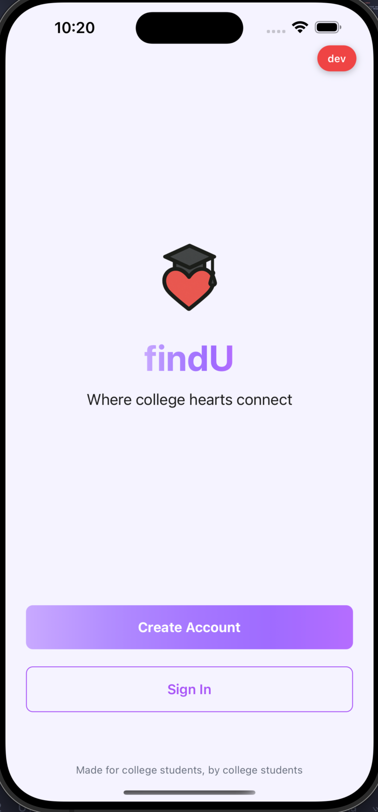
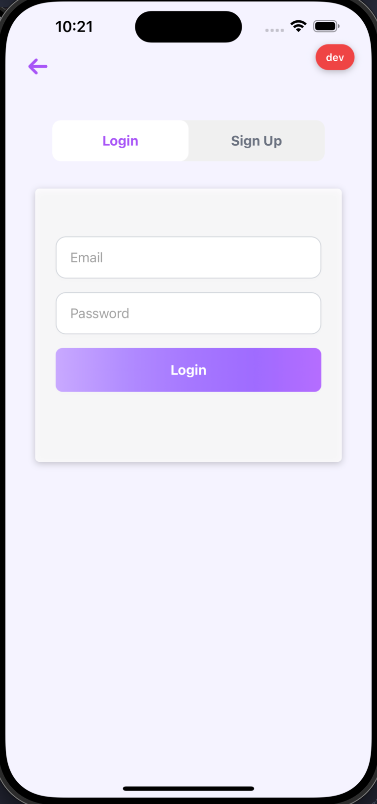
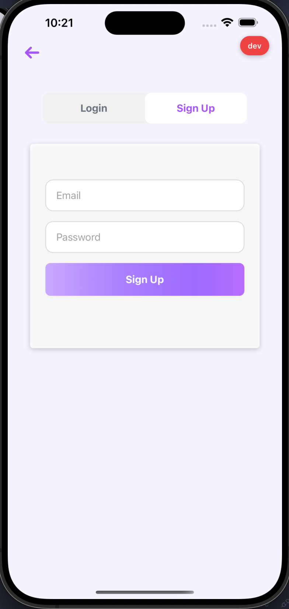

# FindU – College Dating & Social Discovery App

## **Project Overview**

**FindU** is a mobile-first social discovery and dating app built exclusively for college students. Focused on authenticity and safety, it helps students connect through their campus community, shared interests, and personal goals without the distractions of generic dating platforms.

### **Core Mission**

> Create a **trusted, community-driven dating platform** for college students, verified through their `.edu` email, where they can meet peers from their campus or nearby universities with meaningful intent.

---

## **Tech Stack**

| Layer                | Technology            | Purpose                          |
| -------------------- | --------------------- | -------------------------------- |
| **Frontend**         | React Native + Expo   | Cross-platform mobile app        |
| **State Management** | Zustand               | Lightweight state management     |
| **Backend**          | Node.js + Express     | API server                       |
| **Authentication**   | Supabase Auth         | Email verification & magic links |
| **Database**         | Supabase (PostgreSQL) | Primary data storage             |
| **Cache / Queue**    | Redis                 | Caching, sessions, job queues    |
| **Payments**         | Stripe                | Subscriptions, boosts, tips      |
| **File Storage**     | Supabase Storage      | Profile pictures, chat images    |
| **Hosting**          | Render                | Backend deployment               |

---

## **Preview Images**

### **App Screenshots**

<table>
  <tr>
    <td align="center">
      <br/>
      Startup Page
    </td>
    <td align="center">
      <br/>
      Login Page
    </td>
    <td align="center">
      <br/>
      Signup Page
    </td>
  </tr>
</table>

<!-- Add more images below as needed -->
<!--
<div style="flex: 0 0 auto; text-align: center;">
  
  <div>Profile Page</div>
</div>
-->

</div>

---

## **Features**

- **Authentication System**
  - Email/password and magic link login
  - `.edu` email verification
  - User registration and profile setup
- **Profile Management**
  - Multi-step onboarding (photos, bio, interests)
  - Campus and school selection
  - Intent-based filtering (dating, friendship, etc.)
- **Discovery System**
  - Swipe-based matching interface
  - Campus-based user filtering
  - Interest-based compatibility scoring
- **Matching & Messaging**
  - Mutual like detection
  - In-app chat functionality
  - Message history and read status
- **Safety Features**
  - User blocking system
  - Report functionality
  - Privacy controls
- **Premium Features**
  - Subscription tiers (Bachelors, Masters, PhD)
  - Boost functionality
  - SuperLikes and Icebreakers
- **Payment Integration**
  - Stripe subscription management
  - One-time purchases (boosts, tips)
- **Enhanced Safety**
  - Photo verification
  - Campus-only visibility periods
  - Advanced moderation tools
- **Social Features**
  - Instagram/Spotify integration
  - Group events and meetups
  - Campus-specific activities
- **Analytics & Insights**
  - User behavior analytics
  - Match success tracking
  - Campus engagement metrics

---

## **User Journey**

### **1. Onboarding**

```
Download App → Sign Up via OTP → Login → Profile Setup → Campus Selection → Discover Matches
```

### **2. Discovery**

```
Browse Profiles → Swipe Right/Left → View Compatibility → Send Like → Wait for Match
```

### **3. Matching**

```
Mutual Like → Match Notification → Open Chat → Start Conversation → Meet in Person
```

### **4. Safety & Moderation**

```
Report User → Admin Review → Action Taken → Community Guidelines Enforced
```

---

## **Monetization**

| Revenue Stream            | Description                                      | Status     |
| ------------------------- | ------------------------------------------------ | ---------- |
| **Premium Subscriptions** | Bachelors ($4.99), Masters ($9.99), PhD ($14.99) | Planned |
| **Campus Boosts**         | Pay to increase visibility to nearby users       | Planned |
| **SuperLikes**            | Stand out with premium like feature              | Planned |
| **Tips/Donations**        | Support the platform development                 | Planned |

---

---

## **Getting Started**

See [SETUP.md](./SETUP.md) for detailed setup instructions.

---

---

## **Contact & Support**

- **Email**: findu.team@gmail.com
- **Project Status**: Active Development
- **Platform**: iOS & Android
- **Target Audience**: College students (18-26)
